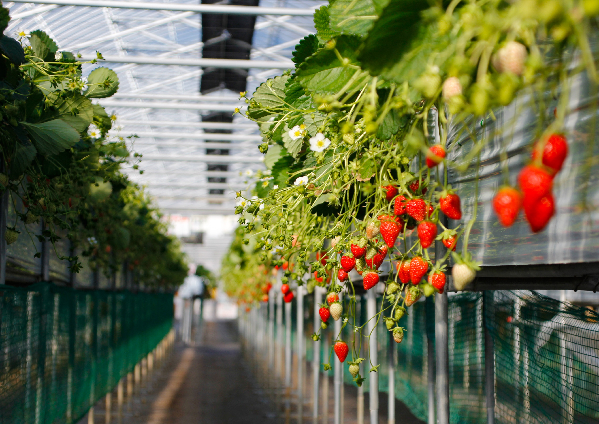

```{r setup, include=FALSE, echo=FALSE, message=FALSE, warning=FALSE}
library(png)
library(jpeg)
library(grid)
library(knitr)
library(kableExtra)
library(tidyverse)
library(revealjs)
library(magrittr)
library(plotly)
```


# {data-background="background/Title.jpg"}


# Beckgroud Information {data-background="background/Background.png"}





# Background Information {data-background="background/Background.png"}

<!-- <p style="font-family: times, serif; font-size:20pt; font-style:bold"> Bees <p> -->
<br>

<p style="font-size:32pt; font-style:bold">__Bees__<p>

- Natural pollinator

- Increase fruit size, yield, quality

- Various habitats


<p style="font-size:32pt; font-style:bold; text-align: right">__Pesticides__</p>

<p style="text-align: right">Protect the growth of strawberries * </p>

<p style="text-align: right">Fungicide: prevent fungal disease * </p>

<p style="text-align: right">insecticide: control insects * </p>


# Our Question {data-background="background/Background.png"}

<br>
<br>
<br>
<br>
<br>
<p style="text-align: center; font-size:34pt; font-family: times, serif">__What's the change of bee-harmed pesticides__ </p>
<p style="text-align: center; font-size:34pt; font-family: times, serif">__usage across states and why?__ </p>


# Overview of the Data {data-background="background/Straw_map.png"}

<p style="text-align: right; font-size:14pt; font-family: times, serif">Citation: https://www.agmrc.org/commodities-products/fruits/strawberries </p>


# Overview of the Data {data-background="background/Background.png"}

<!-- <p style="text-align: center; font-size:28pt; font-family: times, serif">__Bee.Toxins Count number in each year__ </p> -->


# Overview of the Data {data-background="background/Background.png"}

<!-- <p style="text-align: center; font-size:28pt; font-family: times, serif">__Number of Type__ </p> -->


# Overview of the Data {data-background="background/Background.png"}

<!-- <p style="text-align: center; font-size:28pt; font-family: times, serif">__Pesti&Fungi usage in States through Year__ </p> -->


# Overview of the Data {data-background="background/Background.png"}

<!-- <p style="text-align: center; font-size:28pt; font-family: times, serif">__Insecticide Usage in California & Florida__ </p> -->


# EDA: Type vs Value {data-background="background/Type_vs_Value.png"}


# EDA: Type vs Value {data-background="background/Type_Value_Year.png"}


# EDA: BeeToxin vs Value {data-background="background/Bee_vs_Value.png"}


# EDA: BeeToxin vs Value {data-background="background/Bee_Value_Year.png"}


# Shiny Application {data-background="background/Background.png"}

https://jacobchen.shinyapps.io/BEEProjecy/


# Results {data-background="background/Background.png"}


* Reduction of usage in 2018, but bounced back in 2019
  
* More varieties of pesticides used over three years

  + Same pattern as amount of pesticides
  
  + More high bee-toxin pesticides were used
    
    
* Florida surpassed California in the usage of pesticides


# Discussion {data-background="background/Background.png"}
<br>

* Pesticides lead to distinction of 41% insects in next few decades

  + Neonics: far-reaching effects on bees, birds, etc.
  
  + Build-up effects on environment: underground water, soil 

* High bee-toxicity pesticides should be limited

  + EU expanded ban on three types of bee-harmful pesticides in 2018
  
  + US banned 12 pesticides in 2019; followed by a total ban in 2020 by EPA
    
    - 2019, California banned pesticides that harm children growth
    
    - Florida pesticides companies challenged bans
<br>


# Discussion... {data-background="background/Background.png"}


* Modest solutions by EPA (Environment Protection Agency)

  + Limit the time window for use of pesticides
  
  + Integrated Pest Management plan: cultural, mechanical, and biological pest controls
  
  + Leave a buffer area between treated areas and areas where wildlife may be present
  
  + Take care when planting treated seeds to prevent dust that could affect bees

<p style="text-align: right; font-size:14pt; font-family: times, serif">Citation: https://www.epa.gov/safepestcontrol/integrated-pest-management-ipm-principles </p>


#  {data-background="background/Quesfinal.png"}

<br>
<br>
<br>
<br>
<br>
<p style="font-family: times, serif; font-size:48pt"> __Any Question?__ <p>


# {data-background="background/Ending.jpg"}


